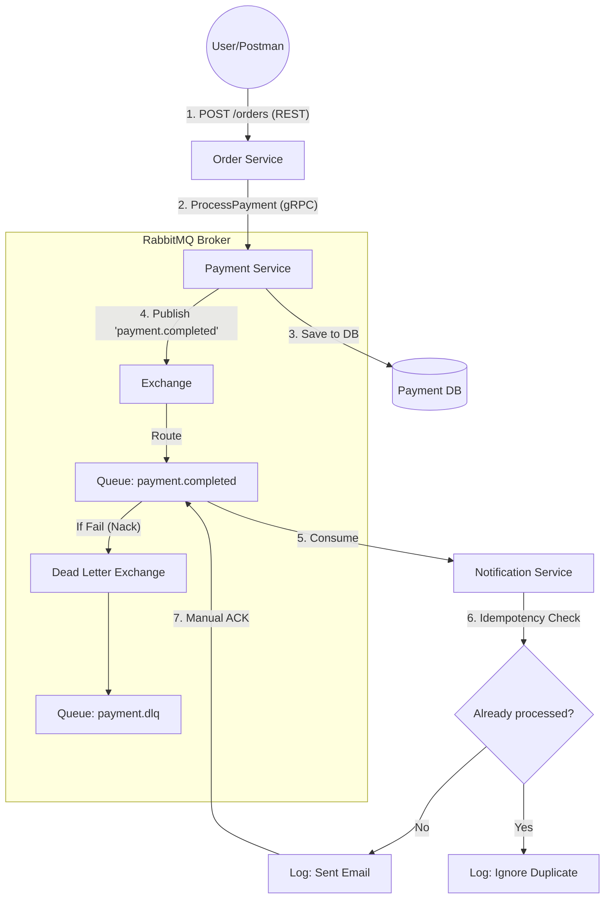
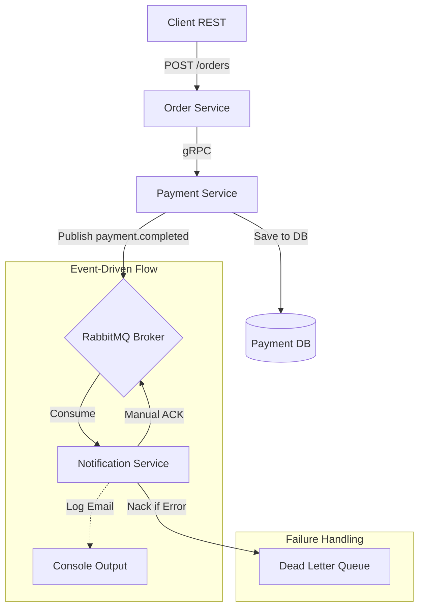

# Advanced Programming 2 - Assignment 3
**Student:** Medina Nurbek
**Topic:** Event-Driven Architecture (EDA) with Message Queues

## Project Overview
This project implements an asynchronous event-driven flow between microservices using **RabbitMQ**. When a payment is successfully processed in the `payment-service`, it publishes an event that the `notification-service` consumes to simulate sending an email.

### Event Flow:
1. **Order Service**: Receives order requests via REST and triggers payment via gRPC.
2. **Payment Service**: Processes payment, saves to PostgreSQL, and publishes a `payment.completed` event to RabbitMQ.
3. **Notification Service**: Listens for `payment.completed` events, ensures they are not duplicates (Idempotency), and logs the notification.

### Architecture Diagram:


## Reliability & Delivery Guarantees

### 1. Manual Acknowledgments (ACKs)
To ensure **at-least-once delivery**, we have disabled `auto-ack` in the `notification-service`. 
- The service only acknowledges the message (`d.Ack(false)`) **after** the processing logic (logging) has successfully completed.
- If the service crashes during processing, the message remains in the queue and will be redelivered when the service restarts.

### 2. Message Persistence
- **Durable Queues**: All queues are declared with `durable: true`, meaning they survive a RabbitMQ broker restart.
- **Persistent Messages**: The `payment-service` publishes messages with `DeliveryMode: amqp.Persistent`, ensuring messages are written to disk.

### 3. Idempotency Strategy
To handle potential duplicate messages safely:
- Every message is published with a unique `MessageId` (derived from the `payment.ID`).
- The `notification-service` maintains an in-memory cache (`processedMessages` map) of IDs it has already processed.
- Before processing a new message, it checks the cache. If the ID exists, it ignores the message but still sends an `Ack` to remove it from the queue.

## Bonus: Dead Letter Queue (DLQ)
We have implemented a **Dead Letter Exchange (DLX)** and **DLQ**:
- If a message fails to be parsed (invalid JSON), it is rejected with `d.Nack(false, false)`, which automatically moves it to the `payment.dlq` thanks to the `x-dead-letter-exchange` configuration.
- This prevents "poison messages" from blocking the main queue.

## Infrastructure
The entire system is orchestrated using Docker Compose:
- **RabbitMQ**: The message broker.
- **PostgreSQL**: Databases for Order and Payment services.
- **Order Service**: Port 8080 (REST).
- **Payment Service**: Port 8081 (REST) / 50051 (gRPC).
- **Notification Service**: Consumer.

## Graceful Shutdown
All services implement graceful shutdown using `os/signal`. They listen for `SIGINT` and `SIGTERM` to close database connections, RabbitMQ channels, and stop HTTP/gRPC servers properly before exiting.

---

## How to Run
```bash
docker-compose up --build
```

## How to Test
Send a POST request to `http://localhost:8080/orders`:
```json
{
  "customer_id": "1",
  "customer_email": "user@example.com",
  "item_name": "Book",
  "amount": 5000
}
```

## Architecture Diagram

