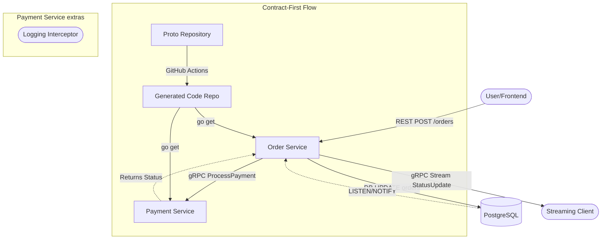

# AP2 Assignment 2 - gRPC Migration & Streaming

**Student:** Taubakabyl Nurlybek  
**Group:** [Your Group]  

## Overview
This project demonstrates the migration of a Microservices system from REST to gRPC following the **Contract-First** principle. It includes real-time order tracking using gRPC Server-side Streaming and PostgreSQL `LISTEN/NOTIFY`.

## Architecture
The system consists of two main services communicating via gRPC. The Order Service also provides a real-time streaming endpoint for status updates.



## Repositories
- **Proto Repository:** [Link to Protos Repo](https://github.com/medinanurbek/protos-reprository)
- **Generated Code Repository:** [Link to Generated Repo](https://github.com/medinanurbek/generated-repo)

## Key Features
- **Contract-First**: Protos are managed in a separate repo with automated Go code generation via GitHub Actions.
- **gRPC Unary**: Internal payment processing between Order and Payment services.
- **gRPC Streaming**: Real-time order status updates triggered by database changes (PostgreSQL `NOTIFY`).
- **Clean Architecture**: Business logic remains separated from the transport layer.
- **Interceptor**: Logging middleware in the Payment Service to track request duration.

## How to Run

### 1. Prerequisites
- PostgreSQL running with two databases: `order_db` and `payment_db`.
- Apply the `migrations/init.sql` to `order_db` to setup the LISTEN/NOTIFY trigger.

### 2. Start Services
```bash
# In payment-service directory
go run cmd/payment-service/main.go

# In order-service directory
go run cmd/order-service/main.go
```

### 3. Test Streaming (The Defense Demo)
Open a new terminal and run the demo client:
```bash
go run cmd/order-service/client/main.go --order_id=YOUR_ORDER_UUID
```
Then, update the order status in the DB manually:
```sql
UPDATE orders SET status = 'Paid' WHERE id = 'YOUR_ORDER_UUID';
```
You will see the update appear instantly in the terminal client.

## Environment Variables
- `PAYMENT_GRPC_URL`: Address of the payment gRPC server (default `localhost:50051`).
- `ORDER_DB_DSN`: PostgreSQL connection string for Order Service.
- `GRPC_PORT`: Port for the gRPC server (Order Service uses `50052`).
