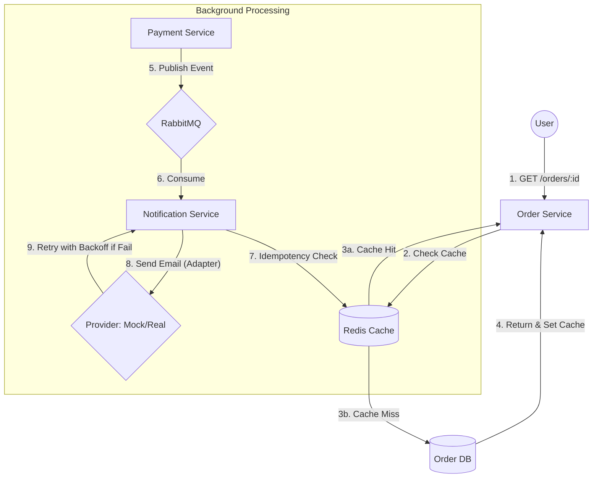

# Advanced Programming 2 - Assignment 4
**Student:** Medina Nurbek
**Topic:** Performance Optimization & External Integrations

## Project Overview
This project builds upon the microservices architecture from previous assignments, introducing **Redis Caching** for performance optimization and a robust **Background Worker** with **Adapter Pattern** for external notifications.

## Key Features

### 1. Redis Caching (Order Service)
- **Pattern**: Cache-aside (Lazy Loading).
- **Read Path**: The system checks Redis for order details before querying the PostgreSQL database.
- **TTL**: Cache keys expire after 5 minutes (300s).
- **Invalidation Strategy**: 
    - **Atomic Invalidation**: The cache key is deleted immediately after any database update (e.g., status change to "Paid", "Failed", or "Cancelled") in the UseCase layer.
    - This ensures data consistency by forcing the next read to fetch the latest state from the database.

### 2. External Provider Adapter (Notification Service)
- **Adapter Pattern**: Decoupled notification logic via `EmailSender` interface.
- **Providers**:
    - `MockEmailSender`: Simulates network latency and random failures to test system resilience.
    - `RealEmailSender`: Implements the same interface for future integration with real APIs like Mailjet or SMTP.
- **Configuration**: Use `PROVIDER_MODE=REAL/SIMULATED` environment variable to toggle between implementations.

### 3. Reliable Background Worker
- **Idempotency**:
    - Uses Redis `SetNX` with the `payment_id` as a key.
    - Ensures that even if RabbitMQ delivers a message multiple times, the notification is only sent once.
- **Retry Policy & Exponential Backoff**:
    - If an external provider fails, the worker retries the job.
    - **Exponential Backoff**: Delays between retries increase progressively (**2s, 4s, 8s**).
- **DLQ Integration**: Messages that fail after all retries are moved to the Dead Letter Queue for manual inspection.

### 4. Bonus: API Rate Limiter
- Implemented a Redis-based middleware for the Order Service.
- **Limit**: 10 requests per minute per IP.
- **Error**: Returns `HTTP 429 Too Many Requests` when the limit is exceeded, demonstrating Redis as a fast shared state store.

## Architecture Diagram


## Infrastructure
- **Redis**: Shared state for caching, rate limiting, and idempotency.
- **RabbitMQ**: Message broker for asynchronous events.
- **PostgreSQL**: Persistent storage for services.
- **Docker Compose**: Complete environment orchestration.

## How to Run
```bash
docker-compose up --build
```
